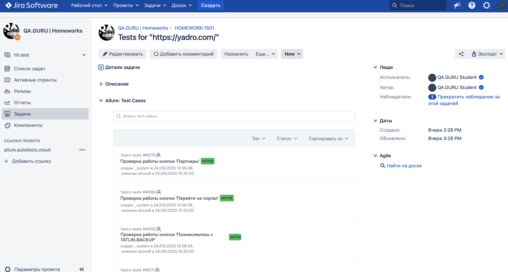

# Проект по автоматизации тестирования сайта [Yadro](https://yadro.com/)  


## **Содержание:**

* [Технологии и инструменты](#технологии-и-инструменты)

* [Реализованные проверки](#реализованные-проверки)

* [Запуск из терминала](#запуск-из-терминала)

* [Сборка в Jenkins](#сборка-в-jenkins)

* [Allure отчет](#allure-отчет)

* [Интеграция с Allure TestOps](#интеграция-с-allure-testops)

* [Интеграция с Jira](#интеграция-с-jira)

* [Уведомление в Telegram при помощи бота](#уведомление-в-telegram-при-помощи-бота)

* [Примеры видео выполнения тестов на Selenoid](#примеры-видео-выполнения-тестов-на-selenoid)  

---
## :star: Технологии и инструменты:  

<p>


</p>  

---
## :open_file_folder: Реализованные проверки:  

- Проверка работы кнопок меню: "Продукты", "Партнеры", "Сервис", "О нас", "Вакансии"
- Проверка контента главной страницы: кнопка продукта, кнопка информации о компании  

---
## :computer: Запуск из терминала:  

<p>Команда для запуска тестов из терминала на удаленном браузере:</p>

```
./gradlew clean ${task} -DremoteUrl=${selenoidUrl}
```

Где: 
- ${task} - название таски, которую вы хотите запустить (test, regress). Таски можно настроить по тегу в файле build.gradle
- ${selenoidUrl} - URL вашего селеноида

Так же можно добавлять параметры:
- `-Dbrowser=название_браузера` - устанавливает браузер, в котором будут запускаться тесты. По умолчанию установлен chrome.
- `-DbrowserVersion=версия_браузера` - устанавливает версию браузера. По умолчанию установлена версия 128 для chrome.
- `-DbrowserSize=ширина x высота` - устанавливает размер окна браузера. По умолчанию задан размер браузера "1920x1080".
- `-Dtimeout=таймаут` - устанавливает таймаут. По умолчанию установлен таймаут 10000 мс.

Команда для локального запуска тестов(без использования селеноида):

```
./gradlew clean ${task} -DisRemote=false
```
Где:
- ${task} - название таски, которую вы хотите запустить (test, regress)
- `-DisRemote=false` - параметр устанавливает значение isRemote как false и при запуске используется локальный браузер. По умолчанию isRemote равен true

---
##  Сборка в Jenkins:  

  

---
##  Allure отчет:  

**Overview:**


**Tests:**

  

---
##  Интеграция с Allure TestOps:  

**Тест-кейсы:**


**Dashboard прогонов:**

  

---
##  Интеграция AllureTestOps с Jira:  

  

---
##  Уведомление в Telegram при помощи бота:  

  

---
##  Примеры видео выполнения тестов на Selenoid:  

 